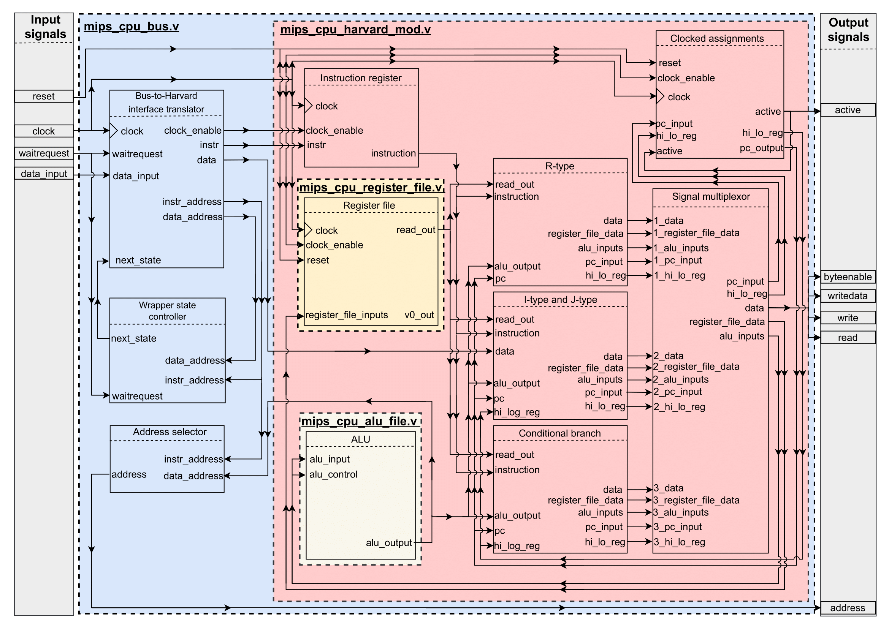

# Table of contents
- [Table of contents](#table-of-contents)
- [Contributors](#contributors)
- [Overview](#overview)
- [Deliverables](#deliverables)
- [Instruction Set](#instruction-set)
- [Memory Map](#memory-map)
- [CPU design diagram](#cpu-design-diagram)

Contributors
=============
- Bradley Stanley-Clamp: <bradley.stanley-clamp19@imperial.ac.uk>
- Brandon Cann: <brandon.cann19@imperial.ac.uk>
- Ebby Samson: <ebby.samson19@imperial.ac.uk>
- Igor Silin: <igor.silin19@imperial.ac.uk>
- Khayle Torres: <khayle.torres19@imperial.ac.uk>
- Xin Wang: xin.wang19@imperial.ac.uk

Overview
=============

The overall goal is to develop a working synthesisable MIPS-compatible CPU that will interface with the world using a memory-mapped bus, which gives
it access to memory and other peripherals.

Particular focus of this project is to develop a piece of IP which could be 
sold and distributed to many clients, allowing them to integrate the CPU
into any number of products.  This entails producing a production quality CPU with a robust testing process.

Deliverables
=======================

The deliverables consist of the following:

1.  `rtl/mips_cpu_bus.v`: A wrapper that translates the bus-based interface into a modified compatiable Harvard architecture.

2.  `rtl/mips_cpu_harvard_mod.v`: A modified version of the MIPS CPU based on the Harvard   architecture

3.  `test/test_mips_cpu_bus.sh`: A test-bench for any CPU meeting the given interface.
    This will act as a test-bench for your own CPU, but should also aim to check
    whether any other CPU works as well. You can include both scripts, but only the
    one corresponding to your submitted CPU (bus or harvard) will be evaluated.

Instruction Set
===============

The target instruction-set is 32-bit little-endian MIPS1, as defined by
the MIPS ISA Specification (Revision 3.2).

The instructions to be tested are:

Code    |   Meaning                                   
--------|---------------------------------------------
ADDIU   |  Add immediate unsigned (no overflow)      
ADDU    |  Add unsigned (no overflow)                 
AND     |  Bitwise and                               
ANDI    |  Bitwise and immediate                     
BEQ     |  Branch on equal                         
BGEZ    |  Branch on greater than or equal to zero   
BGEZAL  |  Branch on non-negative (>=0) and link  
BGTZ    |  Branch on greater than zero             
BLEZ    |  Branch on less than or equal to zero   
BLTZ    |  Branch on less than zero               
BLTZAL  |  Branch on less than zero and link          
BNE     |  Branch on not equal                        
DIV     |  Divide                                     
DIVU    |  Divide unsigned                            
J       |  Jump                                       
JALR    |  Jump and link register                     
JAL     |  Jump and link                              
JR      |  Jump register                              
LB      |  Load byte                                  
LBU     |  Load byte unsigned                         
LH      |  Load half-word                             
LHU     |  Load half-word unsigned                    
LUI     |  Load upper immediate                       
LW      |  Load word                                  
LWL     |  Load word left                             
LWR     |  Load word right                            
MTHI    |  Move to HI                                 
MTLO    |  Move to LO                                 
MULT    |  Multiply                                   
MULTU   |  Multiply unsigned                          
OR      |  Bitwise or                                 
ORI     |  Bitwise or immediate                       
SB      |  Store byte                                 
SH      |  Store half-word                            
SLL     |  Shift left logical                         
SLLV    |  Shift left logical variable                
SLT     |  Set on less than (signed)                  
SLTI    |  Set on less than immediate (signed)        
SLTIU   |  Set on less than immediate unsigned        
SLTU    |  Set on less than unsigned                  
SRA     |  Shift right arithmetic                     
SRAV    |  Shift right arithmetic                     
SRL     |  Shift right logical                        
SRLV    |  Shift right logical variable               
SUBU    |  Subtract unsigned                          
SW      |  Store word                                 
XOR     |  Bitwise exclusive or                       
XORI    |  Bitwise exclusive or immediate             

It is strongly suggested that you implement the following
instructions first: `JR, ADDIU, LW, SW`. This will match
the instructions considered in the formative assessment.

Memory Map
==========

Your CPU should not make any explicit assumptions about the location
of instructions, data, or peripherals within the address space. It should
simply execute the instructions it is given, and perform reads and writes
at the addresses implied by the instructions.

There are only two special memory locations:

- `0x00000000` : Attempting to execute address 0 causes the CPU to halt.
- `0xBFC00000` : This is the location at which execution should start after reset.

Whether a particular address maps to RAM, ROM, or something else is entirely
down to the top-level circuit outside your CPU. It may be that the top-level
is a test-bench which contains small simulated memories, and simply maps
transactions to reads and writes of a verilog array. Or the test-bench
could emulate only the specific addresses that it expects to be read or written,
without tracking the actual memory contents. Alternatively your CPU may have
been synthesised into an FPGA, in which case the memories may correspond
to a large set of block RAMs, DDR, network adaptors, and anything else
your customer decided to attach the CPU to.

CPU design diagram
==========

